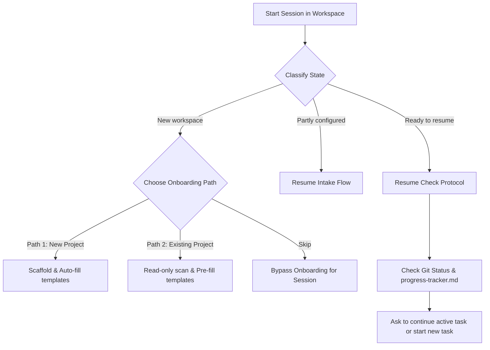

# AgentJoJoy — Generic AI Workspace Template

A workspace template for working with AI coding assistants (Claude Code, Codex, Cursor, Gemini) across multiple projects — both brand-new projects and existing repositories. Designed to feel like working with a **senior dev mentor** who knows when to just execute and when to teach.

---

## Quick Start

1. Click **Use this template** on GitHub to create your own AgentJoJoy workspace repository.
2. Clone your new repository to your machine.
3. Open Claude Code, Codex, Cursor, or Gemini at the workspace root.
4. Ask the AI to read `CLAUDE.md` / `AGENTS.md` and start onboarding.
5. Choose **New Project** or **Existing Project** when the AI asks.

Already have an AgentJoJoy workspace? Use the [Upgrading](#upgrading) flow instead of creating a fresh template copy, so your project notes, decisions, and custom skills are preserved.

---

## Features at a Glance

- **Private-by-default workspace wrapper** — keeps assistant context beside your project instead of inside it, so personal AI notes stay out of project commits.
- **Auto-loading agent rules** — `CLAUDE.md` and `AGENTS.md` give Claude Code, Codex, Cursor, and Gemini a shared starting point.
- **Guided onboarding** — choose a new project or wrap an existing repo; the AI fills only the context you approve.
- **Dual engagement modes** — switch between `execute` for terse delivery and `teach` for pair-programming explanations.
- **Multi-agent coexistence** — coordinate Claude Code, Codex, Cursor, and Gemini without branch or attribution confusion.
- **Privacy-first Gap Reporter** — optional, redacted local notes for workflow friction. No telemetry, no upload.
- **Self-service Gap Collector** — `list`, `summarize`, and `purge` actions help you review or delete local friction notes.
- **Read-only resume checks** — refreshes local branch/worktree state without fetch, pull, push, rebase, merge, or branch switching.
- **Junction Link Model** — supports rigid runtime folders with Windows Directory Junctions while keeping AI system files isolated.
- **Test-first discipline** — encourages the AI to write or stub the failing/reproducing test before implementation or debugging.
- **Portable skills** — `SKILL.md` routines for debugging, review, root-cause analysis, stakeholder updates, and design interviews.

---

## Concept

Each project gets its own **wrapper folder** containing:

- The actual project content (a git repo, docs, anything)
- A `AgentJoJoy/` sibling holding personal AI context
- A central `CLAUDE.md` / `AGENTS.md` at the root that drives the AI

### Context & Tool Mapping

| Context | Tool | Entry Point | Onboarding Path |
| :--- | :--- | :--- | :--- |
| **Team repo (work)** | Claude Code + Cursor | `CLAUDE.md` + `AGENTS.md` | Path 2 + English default |
| **Personal project** | Claude / Codex / Gemini | `CLAUDE.md` / `AGENTS.md` | Path 1 + preferred language |

---

## Workspace Lifecycle

The template automatically detects whether the workspace is new, partly configured, or ready to resume:



### Onboarding Paths (Intake Phase)

- **Path 1 — New project**: AI asks minimal questions, proposes a folder structure, and scaffolds empty templates.
- **Path 2 — Existing project**: AI scans the project read-only (README, manifests, git status), extracts context, fills metadata, and proposes a portable rules snippet for the target repo.

### Daily Session (Resume Phase)

When a session starts in a configured workspace, the AI reads `progress-tracker.md`, checks git status, reports active worktrees/branches, and asks whether to resume the current task or start a new one.

---

## Privacy & Local-First Guarantees

AgentJoJoy is designed so that **everything stays on your machine** unless you choose to share it. We aim for **transparency over implicit behavior** — the AI should never quietly collect, transmit, or do anything to your data that you didn't explicitly agree to.

### What the AI may write to your workspace

- **Project templates** (`AgentJoJoy/agent-context/*.md`) — filled during intake from your answers and any read-only repo scans. You see and approve every fill.
- **`progress-tracker.md`** — daily work tracker. The AI updates it after meaningful work actions. The managed git-state block is generated by [`worktree-auto-sync.ps1`](AgentJoJoy/agent-tools/worktree-auto-sync.ps1) using **read-only** git commands (`status`, `branch --show-current`, `worktree list`) — no fetch, pull, push, rebase, merge, or branch switch.
- **Gap reports** (`AgentJoJoy/agent-runtime/gaps/gap-*.md`) — **only if you opt in** to the Automated Gap Reporter during intake. These are redacted observations of workflow friction (no paths, URLs, credentials, emails). See below.

### Automated Gap Reporter (opt-in)

The Gap Reporter is **disabled by default until you say "enabled" at intake**. When enabled:

- The AI may write redacted friction observations to `AgentJoJoy/agent-runtime/gaps/gap-<timestamp>.md` when it hits a workflow obstacle worth remembering.
- Reports must not contain real project names, remote URLs, absolute paths, credentials, tokens, emails, IPs, or source code. Redaction is the AI's responsibility, with a defense-in-depth signal scanner in the collector.
- Reports stay local. They are ignored by git via `.gitignore` and must never be committed to a wrapped project repo.
- You can toggle the setting any time by editing `AgentJoJoy/agent-context/engagement-mode.md`.

### Gap Report Collector (separate opt-in, your retrospective tool)

The collector ([`gap-report-collector.ps1`](AgentJoJoy/agent-tools/gap-report-collector.ps1)) is a **personal retrospective tool** for you, the workspace owner. It is local-only — no network calls, no telemetry, no upload. Run it manually to:

```powershell
# List your gap reports (file, last write, exportable/blocked, category)
powershell -ExecutionPolicy Bypass -File AgentJoJoy/agent-tools/gap-report-collector.ps1 -Action list

# Group by category, show recent patterns, ends with an opt-in upstream invitation
powershell -ExecutionPolicy Bypass -File AgentJoJoy/agent-tools/gap-report-collector.ps1 -Action summarize

# Delete all gap reports and collector outputs (requires -Force)
powershell -ExecutionPolicy Bypass -File AgentJoJoy/agent-tools/gap-report-collector.ps1 -Action purge -Force
```

The collector is also disabled by default for Path 2 team repos. Enable it only with explicit awareness of any team/company data-safety constraints.

### Sharing patterns back upstream (fully optional, user-initiated)

If `-Action summarize` reveals a recurring friction that the AgentJoJoy template itself should fix, you may **manually** copy the redacted summary into a GitHub issue at https://github.com/Joyperm/AgentJoJoy/issues. Nothing is sent automatically — the script never talks to the network.

### What the template **never** does

- ❌ No telemetry, no analytics, no usage tracking sent off-machine.
- ❌ No automatic uploads, fetches, or remote calls from any helper script.
- ❌ No background daemons or scheduled tasks installed.
- ❌ No writes to your project repo's git history (gap reports live outside the wrapped repo and are gitignored).
- ❌ On company machines, remote sync/upload of gap data is hard-blocked by policy; any transfer must be manual and owner-approved.

---

## Git Sync Strategies

When the upstream base branch (`main`) moves while you have work in progress, AgentJoJoy helps you choose the best sync strategy:

- **Merge** — preserves history. Recommended when task commits are already pushed or under PR review.
- **Rebase** — replays commits onto the latest `main`. Recommended when task commits are local-only and clean.
- **Squash & Rebase** — collapses noisy WIP commits into one before replaying. Recommended for messy/WIP local work.

See [`AgentJoJoy/agent-rules/workflow-notes.md`](AgentJoJoy/agent-rules/workflow-notes.md) for the full decision guide.

---

## Folder Structure

### Daily Tracking
- [`progress-tracker.md`](progress-tracker.md) — central list of active branches, worktrees, tasks in progress, and next steps. Read first by the AI.

### Project Metadata (AI-fillable)
- [`AgentJoJoy/agent-context/project-overview.md`](AgentJoJoy/agent-context/project-overview.md) — project identity, type, stack, work areas.
- [`AgentJoJoy/agent-context/architecture.md`](AgentJoJoy/agent-context/architecture.md) — codebase architecture, invariants, boundaries (optional).
- [`AgentJoJoy/agent-context/standards.md`](AgentJoJoy/agent-context/standards.md) — code style and testing guidelines.
- [`AgentJoJoy/agent-context/ui-context.md`](AgentJoJoy/agent-context/ui-context.md) — UI framework context (optional).
- [`AgentJoJoy/agent-context/domain-language.md`](AgentJoJoy/agent-context/domain-language.md) — project-specific glossary (optional).

### Workflow & AI Rules
- [`CLAUDE.md`](CLAUDE.md) / [`AGENTS.md`](AGENTS.md) — entry points that load automatically and define session start protocols.
- [`AgentJoJoy/agent-rules/workflow-spec.md`](AgentJoJoy/agent-rules/workflow-spec.md) — detailed workflow rules for approvals, worktrees, verification, sync, and cleanup.
- [`AgentJoJoy/agent-rules/ai-workflow-rules.md`](AgentJoJoy/agent-rules/ai-workflow-rules.md) — AI permission boundaries.
- [`AgentJoJoy/agent-rules/intake-flow.md`](AgentJoJoy/agent-rules/intake-flow.md) — step-by-step Path 1 / Path 2 onboarding guide.
- [`AgentJoJoy/agent-rules/workspace-model.md`](AgentJoJoy/agent-rules/workspace-model.md) — wrapper, team repo, and worktree ownership model.
- [`AgentJoJoy/agent-rules/workflow-notes.md`](AgentJoJoy/agent-rules/workflow-notes.md) — branch sync recommendations and operational tips.
- [`AgentJoJoy/workflow-guide.md`](AgentJoJoy/workflow-guide.md) — English onboarding manual.
- [`AgentJoJoy/workflow-guide-th.md`](AgentJoJoy/workflow-guide-th.md) — Thai onboarding manual.
- [`AgentJoJoy/agent-tools/`](AgentJoJoy/agent-tools/) — local helper tools (Gap Reporter, Clean Ejection script, Worktree Auto-Sync).
- [`AgentJoJoy/agent-templates/`](AgentJoJoy/agent-templates/) — reusable snippets and portable inserts.
- [`AgentJoJoy/agent-decisions/`](AgentJoJoy/agent-decisions/) — key decisions log.

### Portable Skills (SKILL.md)
- [`AgentJoJoy/skills/agentjojoy-core-practices/SKILL.md`](AgentJoJoy/skills/agentjojoy-core-practices/SKILL.md) — portable routines for Debugging, Code Review, Root Cause Analysis, and Management-Talk rewriting.
- [`AgentJoJoy/skills/grill-me/SKILL.md`](AgentJoJoy/skills/grill-me/SKILL.md) — structured design interview for vague plans.

---

## How to Use

### Option A — Use This Template (Recommended)

For a new workspace, use GitHub's template flow:

1. Click **Use this template** on the GitHub repository page.
2. Create a new repository under your account or organization.
3. Clone that new repository to your machine.
4. Open your AI assistant at the cloned workspace root.
5. Paste:

```text
Please read CLAUDE.md / AGENTS.md and start the AgentJoJoy onboarding intake flow.
```

The AI will load the workspace rules and ask whether this is a new project, an existing project, or something to skip for now.

### Option B — Existing Project Wrapper

If you already have a project repo or document folder, create an AgentJoJoy workspace first, then choose **Existing Project** during onboarding. The AI will scan the existing project read-only, explain where personal AI files live, and ask before moving, cloning, linking, or writing anything.

### Option C — Local Copy Fallback

If GitHub's template button is unavailable, clone or download this repository, copy the wrapper folder to your workspace, and remove the copied `.git` directory before onboarding. Prefer **Use this template** when available; it avoids the manual copy-and-cleanup step.

> [!NOTE]
> **Cross-platform note:** The AgentJoJoy workflow and documents can be used on Windows, macOS, or Linux. The bundled helper scripts are currently PowerShell-first and tested on Windows. On macOS/Linux, ask your AI assistant to translate helper commands to the local shell before running them, and approve any state-changing command first.

### Ejecting the Wrapper

To return a workspace to its normal, unwrapped state (e.g., before sharing or removing the personal AI operating layer):

```powershell
powershell -ExecutionPolicy Bypass -File AgentJoJoy/agent-tools/eject.ps1 -Action eject
```

This deletes the `AgentJoJoy/` directory, `CLAUDE.md`, `AGENTS.md`, `VERSION`, and `progress-tracker.md`.

> [!NOTE]
> **Surgically Safe Settings Cleanup**: If **Distraction-Free Mode** was enabled, the script automatically parses `.vscode/settings.json` and surgically removes only the AgentJoJoy system exclusions, keeping any other project-specific editor or linter configurations 100% untouched. If no other settings remain in `.vscode/settings.json`, the script cleanly deletes the settings file and the empty `.vscode/` directory.

---

## Upgrading

The **Use this template** button is only for creating a new workspace. To update an existing AgentJoJoy workspace, use the upgrade prompt below. The AI compares your workspace with a specific release tag, preserves your project-owned files, and asks before applying template changes.

AgentJoJoy is **AI-driven**, so upgrades are too. There is no install script to maintain and no package manager. Instead, you paste a canonical upgrade prompt into your AI assistant (Claude Code, Cursor, Codex, Gemini), and the AI handles the work using the project's own file-ownership rules.

> [!WARNING]
> **Upgrading Pre-v1.2.4 Workspaces with Custom Skills**: In template versions prior to `v1.2.4`, the file ownership rules (`AgentJoJoy/agent-rules/file-ownership.md`) classified the entire `AgentJoJoy/skills/` directory as template-owned. If your workspace contains custom project-specific skills (i.e. folders in `AgentJoJoy/skills/` other than `agentjojoy-core-practices` or `grill-me`), the upgrade agent may attempt to delete them. Before running the upgrade prompt, either manually edit your local `file-ownership.md` to classify your custom skills as user-owned, or explicitly instruct the agent: *"Preserve my custom skills in AgentJoJoy/skills/ (do not delete or overwrite them)"*.

### Check your current version

```powershell
type VERSION
```

(The `VERSION` file lives at your workspace root and was stamped when you installed the template. If it's missing, your workspace pre-dates v1.2.0 — the upgrade prompt below handles that case.)

### Check what's new

See [CHANGELOG.md](CHANGELOG.md) in this repository — and the [Releases page](https://github.com/Joyperm/AgentJoJoy/releases) for human-readable highlights per version.

### Canonical Upgrade Prompt

Open your AI assistant in the workspace root and paste:

```text
Please upgrade this AgentJoJoy workspace to the latest published template version.

Procedure:
1. Read the VERSION file at the workspace root. If it does not exist, treat the current version as "pre-v1.2.0" and proceed.
2. Identify the target version and fetch the latest source content. Try these in order:
   a. Check the latest release tag from https://github.com/Joyperm/AgentJoJoy/releases and the public CHANGELOG.md.
   b. Clone the target tag locally to a temporary folder using a shallow clone:
      `git clone --depth 1 --branch <tag> https://github.com/Joyperm/AgentJoJoy.git temp-agentjojoy-upgrade`
      (Use this clone as the source of truth for the upgrade.)
   c. If fetching or cloning is unavailable (no network, blocked runtime, offline session), ask me for the target version and a local path to a pre-existing clone of that tag.
   d. If neither is possible, stop and report what's missing — do not guess content.
3. If the local version equals the target version, stop and report "already at latest".
4. Otherwise, read AgentJoJoy/agent-rules/file-ownership.md to know which files are template-owned, user-owned, or mixed.
5. Walk the changes file by file (comparing the workspace files to the target clone source):
   - For template-owned files: propose the new content; apply only after my approval.
   - For mixed files: show a diff focused on structural/prose changes, preserve my filled values, apply after my approval.
   - For user-owned files: do not modify. If a structural migration is required, propose a manual edit plan with per-section approval.
6. When done, update the VERSION file to the latest tag and log the upgrade in progress-tracker.md under Recent Actions with the date and version transition (e.g. "Upgraded AgentJoJoy template v1.1.0 -> v1.2.0").
7. Clean up by deleting the temporary upgrade directory (e.g. `temp-agentjojoy-upgrade`) using a safe OS command (e.g. `rmdir /s /q` or `Remove-Item`).

Constraints:
- Never run git push, pull, commit, merge, or branch switch without explicit approval.
- Check if a remote origin is configured for the workspace root repository before attempting any Git push operations. If no remote is configured, do not attempt to push and stop after committing locally.
- Preserve all content in agent-context/, agent-decisions/, agent-runtime/, and progress-tracker.md (except the auto-sync managed block, which is template-owned).
- If unsure about a file's ownership, ask before changing it.
```

The AI will read [`AgentJoJoy/agent-rules/file-ownership.md`](AgentJoJoy/agent-rules/file-ownership.md), follow per-file approval gates, and never touch your project content. You can stop the upgrade at any point.

### Manual upgrade (alternative)

If you prefer a fully manual approach, the same file-ownership table in [`AgentJoJoy/agent-rules/file-ownership.md`](AgentJoJoy/agent-rules/file-ownership.md) tells you which files are safe to overwrite from a freshly cloned latest version, which to leave alone, and which to merge by hand.

## License

[MIT License](LICENSE) © 2026 Joyperm
